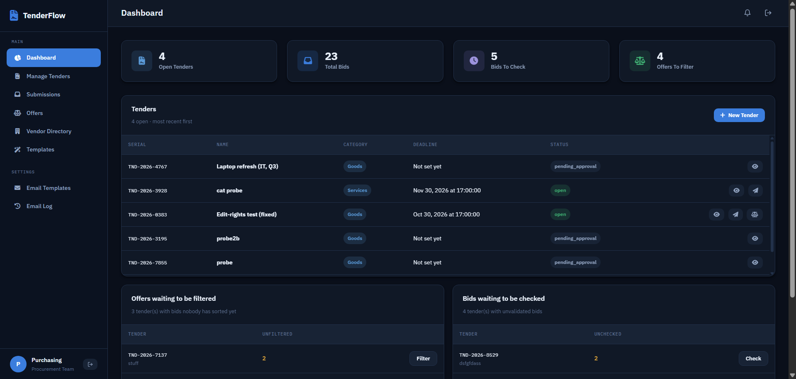
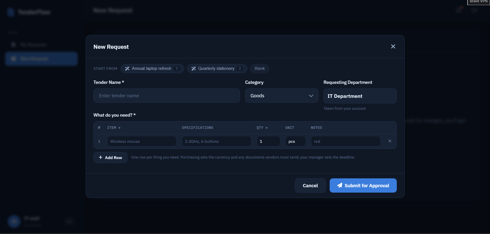
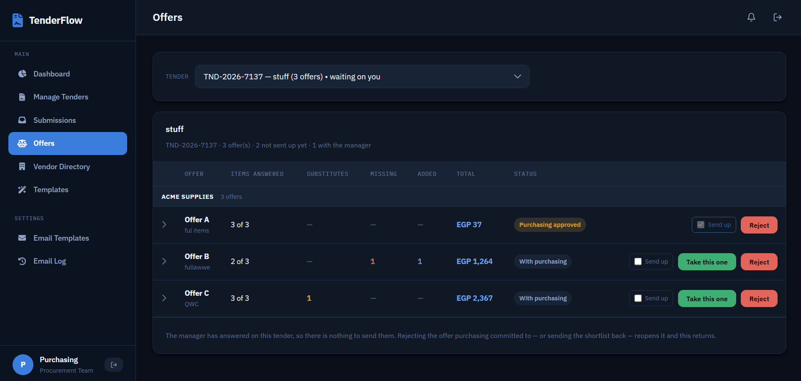

# TenderFlow

An internal procurement app. A department raises a request, their manager
approves it, purchasing takes it to vendors, quotations come back, somebody is
awarded, and the warehouse receives what turns up.

FastAPI + Postgres behind a dependency-free single-page frontend. No build step
on either side.

## Screenshots

**Purchasing's dashboard** — the counts that decide what to do next, the open
tenders, and two work queues: bids nobody has sorted yet, and bids nobody has
checked.



**Raising a request** — the requester fills in a table of what they need, not a
paragraph. The pills across the top are purchasing's quick-fill templates, and
the number on each is how many rows it fills.



**Purchasing's offers desk** — every bid on one tender, grouped by vendor, with
what each one quoted set against what was asked for: items answered,
substitutes, missing, added.



## Running it

```bash
cd backend
pip install -r requirements.txt
cp .env.example .env          # set JWT_SECRET and SEED_ADMIN_PASSWORD
docker compose up -d          # Postgres on :5432
python -m alembic upgrade head
python seed.py                # departments + one admin login
python -m uvicorn main:app --port 8000 --reload
```

The uvicorn target is `main:app` — `main.py` sits at the backend root, not in
`app/`. Health check is `GET /health`; API docs at `/docs`; everything else is
under `/api`.

`main.py` also serves `frontend/` at `/`, so `http://localhost:8000` is the
staff app and `/vendor.html` is the vendor form. Opening `frontend/index.html`
straight off the filesystem works too — the JS points itself at
`http://localhost:8000/api` when it sees a `file://` origin.

## Layout

```
backend/
  main.py            entrypoint; mounts every router under /api
  app/
    config.py        settings from .env
    models/          SQLAlchemy tables
    schemas/         Pydantic request/response shapes
    core/            auth, guards, audit, rate limits, time, pagination
    services/        serials, email rendering, file storage
    routers/         one file per resource
  alembic/           migrations
  seed.py            departments + bootstrap admin
frontend/
  index.html         page shell and every modal
  script.js          the staff app: auth, API client, routing, one render function per page
  style.css          design tokens, then components
  vendor.html/js/css the vendor's page — a separate site (see below)
  vendor.i18n.js     English and Arabic strings for that page
```

There is no framework. Pages render with template literals into `innerHTML`, so
anything interpolated from the API goes through `escapeHtml` or `escapeAttr`
first.

## Who does what

Roles are `admin`, `procurement`, `manager`, `supply_chain`, `finance`,
`employee`. **Seniority and function come from the department, not the role.**
A `manager` in the IT department approves IT's requests; a `manager` in
Purchasing runs the purchasing desk. That distinction is `is_purchasing_manager`
in `core/scope.py`, and `require_purchasing()` beside it grants the purchasing
manager everything `procurement` can do. `canPurchase()` in `script.js` is the
same predicate in the browser.

The warehouse is a department too, not a role — whoever is attached to it gets
the receiving screens.

## The flow

1. An employee or manager raises a request: a name, a category, and a table of
   what they need. They are not asked for a currency, a deadline or a budget —
   none of those are theirs to decide.
2. Their department manager approves it and sets the deadline, or edits it
   directly, or declines it. Purchasing can change the required documents but
   not the request itself: a request says what the department needs, so it
   isn't purchasing's to reword.
3. Purchasing invites vendors from the directory, filtered to the tender's
   category. Each invited vendor gets a mailed link.
4. Vendors quote through that link. One vendor can file several offers, each a
   complete way of answering the tender, and can quote fewer or more than asked
   for, substitute an item, or add one at a price of 0.
5. Purchasing filters the bids, then either commits to one directly or forwards
   a shortlist to the department manager. The manager sees offers anonymised —
   `Offer A`, `Offer B`, no vendor name.
6. Approval runs purchasing → purchasing manager → supply chain, and the award
   emails go out.
7. The warehouse receives against the purchase's own item list, whether that
   purchase came from a vendor's offer or from a basket purchasing built.

**Baskets** are the exception path: one tender bought from several suppliers,
including ones bought by hand. A single requirement can be split across vendors
— four units, one from here and three from there. Everything still passes
through the warehouse, and finance is told whether it was prepaid and whether
the supplier is on the books.

**Urgent** skips the wait, not the record: the purchase is approved
immediately, but purchasing, supply chain, finance and the warehouse all still
see it.

## Vendors are not users

A vendor has no account and never signs in. `POST /api/auth/login` refuses
`role=vendor` outright. Their entire surface is two public endpoints:

```
GET  /api/vendor/invite/{token}          read the tender they were invited to
POST /api/vendor/invite/{token}/submit   file a quotation, with documents
```

The token is per vendor per tender, so a link identifies who is quoting without
anybody logging in. It also means a forwarded link files a quotation in the
wrong company's name, which is why the page says so.

Vendor records themselves belong to purchasing: `/api/vendors` is a staff
directory that purchasing and admin create, edit and file under categories. A
vendor carries several categories and matches an invite list on any of them.

### The vendor page is bilingual

`vendor.html` is a separate site — different stylesheet, no sidebar, no
login — because it is the one page an outsider ever sees. It runs in **English
or Arabic**, switched by the button in the masthead and remembered per browser;
`?lang=ar` on the link opens it in Arabic directly.

Every string lives in `vendor.i18n.js`. Switching flips `dir` on the document
and re-renders in place, keeping whatever is half-typed. Prices and quantities
stay in Latin digits in both languages — the number inputs can't show anything
else, and a form that mixed the two would be worse than one that picked.

The rest of the app is English only, deliberately.

## Categories

Categories are a table the admin owns, not an enum: name, slug, active flag,
order. The slug is the stable key, so renaming a category relabels every screen
and unfiles nothing. Retiring one takes it out of the pickers while everything
already filed under it keeps reading correctly; `DELETE` only succeeds if
nothing has ever used it.

## Notes

- **Time.** `core/time.py` is the one definition of "now". `SERVER_TIMEZONE`
  is an IANA name; empty means the server's own zone.
- **Email.** Leave `SMTP_HOST` empty and award mail is rendered and logged but
  never sent. `MAIL_REDIRECT_TO` reroutes every vendor email to one address for
  testing — leave it empty in production or no vendor ever receives anything.
- **Rate limiting** is in-memory: counters reset on restart and each worker
  keeps its own. Turn it off (`RATE_LIMIT_ENABLED=false`) for a full manual
  test pass, because the vendor submit ceiling is 5/hour per IP.
- **CORS** is `*` so the frontend can run off `file://` with no web server. It
  is paired with `allow_credentials=True`, which makes Starlette echo back
  whatever origin asks. Harmless while auth is Bearer-header only; don't carry
  that pair into a deployment.
- **Testing** is manual against a running dev database. There is no automated
  suite yet.

## Dev accounts

`dev_accounts.py` creates one account per desk, all sharing one password, and
attaches each to the department that gives them their authority. It is
gitignored for that reason — write your own, or create the accounts through
`/api/users` as the seeded admin.

| user | role | department |
|---|---|---|
| `mgr1` | manager | IT Department (department manager) |
| `pmgr1` | manager | Purchasing (**the purchasing manager**) |
| `proc1` | procurement | Purchasing |
| `sc1` | supply_chain | Supply Chain |
| `fin1` | finance | Finance Department |
| `emp1` | employee | IT Department |
| `wh1` | employee | Warehouse |

`admin` comes from `seed.py` and the `SEED_ADMIN_*` values in `.env`.

Account emails are `@tenderflow.com`, deliberately not `.local`: pydantic's
`EmailStr` rejects reserved TLDs, so an account created with one logs in fine
and then 500s serialising the user into the token response.

## Not done yet

- **Move authentication out of the application database.** Users, password
  hashes and login throttling all live in the same Postgres the tenders are in,
  and `auth.py` verifies passwords itself. An identity provider — Keycloak or
  similar — should own accounts, sessions and password policy, with the app
  holding only a subject id and a role claim. This is the largest remaining
  piece and everything below is smaller than it.
- **Change the seeded admin password before this is reachable from anywhere.**
  `backend/.env` was once committed, so its `SEED_ADMIN_PASSWORD` is in the git
  history. `JWT_SECRET` was rotated and the history rewritten, but rotating the
  file never touched the admin row already in a seeded database.
- **Two approval chains still exist.** The per-offer one sits beside the basket
  chain and both write `tenders.awarded_*`. The basket supersedes it — it is
  the only one that can buy four items from three vendors — so the offer chain
  should go, once the Offers desk stops driving it.
- **Split baskets email nobody.** A basket from one vendor sends win and lose
  notices; a split one writes `awarded_vendor_name = "3 vendors"` and sends
  nothing, because telling a vendor they lost a tender they partly won would be
  wrong. Per-vendor award notices are still to write.
- **The award-withdrawn email never sends.** Rejecting an already-approved
  offer withdraws the award, and `send_reassignment_emails` in
  `services/email_service.py` was written to tell the losing vendor — but
  nothing calls it. The template, its "Award Withdrawn" label and its row on
  the Email Templates screen are all live, so the app offers an email it has no
  code path to send. Wire it into the reject path.
- The `vendor` role on `users` is a vestige — vendors have no accounts. It
  should come off the enum.
- Nothing closes a tender when its deadline passes; `is_expired` is computed
  per request instead.
- Per-category item columns, asked for by purchasing: stationery needs no model
  column, tablets do.
- `tender_templates.default_deadline_days` is unused — it is meant to prefill
  the manager's approve dialog.
- Finance has no invoice or payment record, and no PO generation.
- A WhatsApp channel beside the mailer, for vendors with no email on file.
